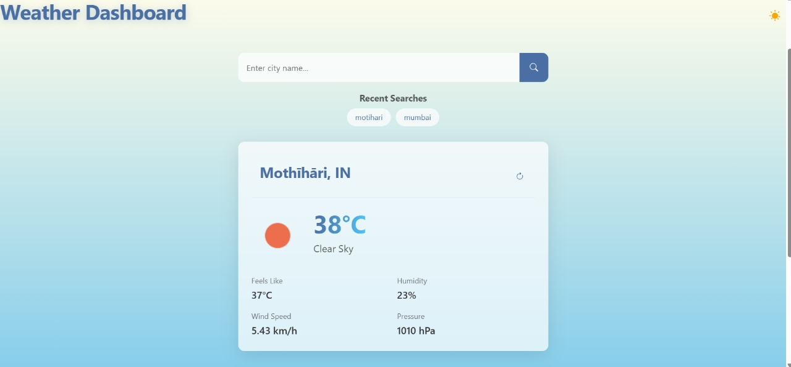
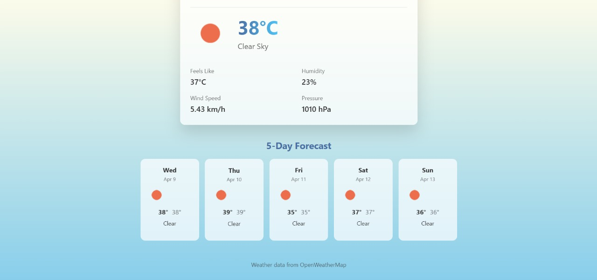

# 🌦️ Weather Dashboard App

A sleek, interactive, and fully responsive Weather Dashboard built using **React** and **Vite**, with immersive background videos, ambient sounds, dark/light themes, and modern UI animations.

---

## 🧠 Features

- 🔍 **Autocomplete Search** for cities using a weather API
- 🌤️ **Dynamic Background Themes** for different weather types (rain, snow, sunny, stormy, cloudy)
- 🎵 **Weather-Specific Background Sounds**
- 🎬 **Weather-Specific Background Videos**
- 🎛️ **Dark/Light Mode Toggle**
- 🌡️ **Temperature Unit Switch** (Celsius/Fahrenheit)
- 📱 **Responsive Design** for all screen sizes
- 🌀 **Smooth scrolling + animations** using GSAP, Locomotive Scroll, and ScrollTrigger
- ❄️ **Glassmorphism design** for a clean modern look

---

## 📸 Preview




---


## 🛠️ Tech Stack

- **React + Vite**
- **HTML5 / CSS3 / JavaScript (ES6+)**
- **GSAP + Locomotive Scroll + ScrollTrigger**
- **Weather API (e.g., OpenWeatherMap)**

---

## 🎨 Styling

- CSS variables for themes & transitions
- Glassmorphism on weather cards and inputs
- Smooth fade/scroll animations using keyframes and GSAP

---

## 📂 Folder Structure

```
weather-dashboard/
│
├── public/                   # Static assets
│   └── sounds/               # Weather-based ambient sounds
│   └── videos/               # Background videos for weather
│
├── src/
│   ├── assets/               # Icons, images, misc assets
│   ├── components/           # Reusable React components
│   ├── hooks/                # Custom React hooks
│   ├── utils/                # Utility functions (e.g., unit conversion)
│   ├── services/             # API logic and wrappers
│   ├── styles/               # Global styles and themes
│   ├── App.tsx               # Main app component
│   └── main.tsx              # Entry point
│
├── .env                      # API keys (ignored in .gitignore)
├── index.html
├── package.json
├── vite.config.ts
└── README.md
```

---

## 🌐 Weather API

- Uses [OpenWeatherMap API](https://openweathermap.org/api) to fetch real-time weather data.
- **Rate Limits**:
  - **Free Tier**: 60 API calls per minute.
  - To avoid rate limiting:
    - Debounce autocomplete input.
    - Cache previous searches.
    - Respect the limit with a throttle mechanism in requests.

---

## 🔧 Getting Started

### 🧱 Prerequisites

- Node.js (v16+)
- npm or yarn

### 📥 Clone and Install

```bash
# Clone the repository
git clone https://github.com/shashwatsaurabh/weather_dashboard.git
cd weather_dashboard

# Install dependencies
npm install
# or
yarn install
```

### ⚙️ Set up API Key

Create a `.env` file in the root directory:

```
VITE_WEATHER_API_KEY=your_openweathermap_api_key
```

> Make sure you never commit `.env` files with sensitive data.

### 🚀 Run the App

```bash
npm run dev
# or
yarn dev
```

### 📦 Build for Production

```bash
npm run build
# or
yarn build
```

---

## 📢 Contributing

Contributions are welcome and appreciated! 🧡

### Steps to Contribute:

1. Fork the repo
2. Create your feature branch: `git checkout -b feature-name`
3. Commit your changes: `git commit -am 'Add new feature'`
4. Push to the branch: `git push origin feature-name`
5. Create a Pull Request

Please follow the [Code of Conduct](CODE_OF_CONDUCT.md) and use conventional commit messages.

---

## 🙌 Acknowledgements

- [OpenWeatherMap API](https://openweathermap.org/)
- [GSAP](https://greensock.com/gsap/)
- [Locomotive Scroll](https://locomotivemtl.github.io/locomotive-scroll/)

---

## 👨‍💻 Author

**Shashwat Saurabh**  
💻 GitHub: [@shashwatsaurabh](https://github.com/shashwatsaurabh)  
🐦 Twitter: [@ShashwatSa98885](https://x.com/ShashwatSa98885)

> Built with coffee, code, and clouds ☁️
